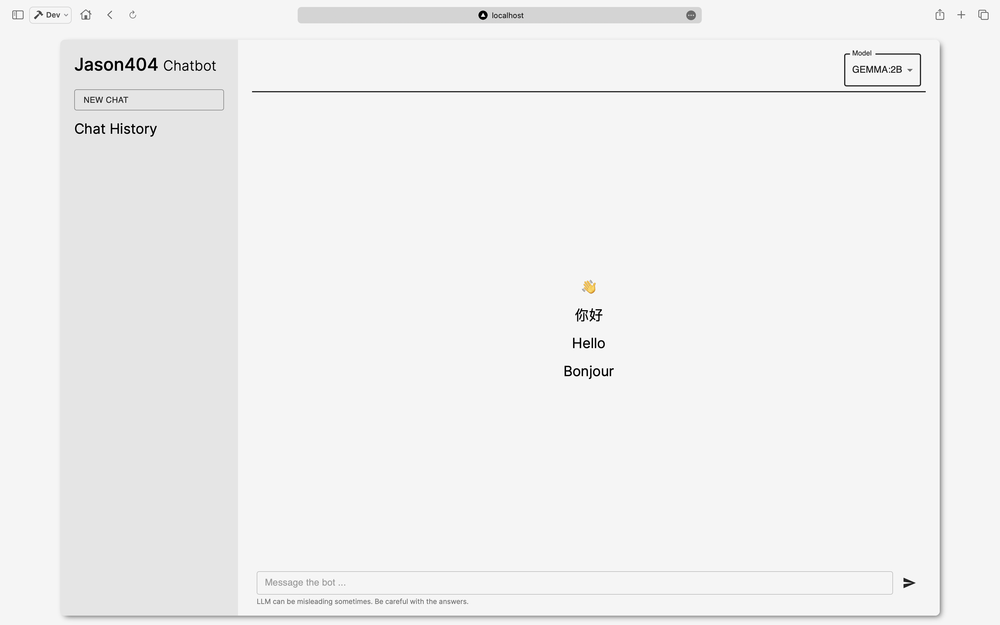
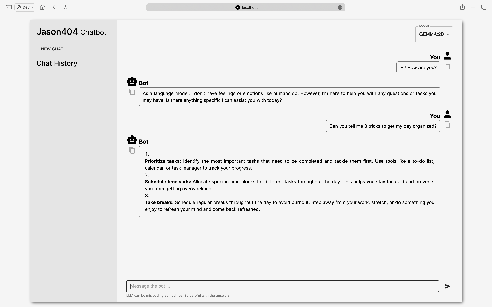
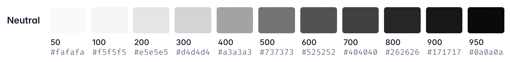

# Jason404 - Chatbot

This is a Chatbot web app that uses the Ollama API to chat with a locally deployed LLM model.

  
  

## Features and Todos

- Chat features
  - [x] Chat with locally deployed Ollama-backend LLM.
  - [x] Continuous conversation.
  - [x] Choose model from local tags.
  - [ ] Chat history. (Database & LocalStorage)
  - [ ] Text file uploading and model fine-tuning.
- App features
  - [ ] Dark mode.
  - [ ] Responsive design.
  - [ ] User authentication.
  - [ ] User settings.
  - [ ] Multi-user support.
- Deployment
  - [x] Run on Node server.
  - [ ] Dockerize the app.

## Dev Details

### Environment Variables

Environment variables are stored in `.env.$(NODE_ENV)` files. By default, the app runs in `development` mode.

Files ending with `.local` are git-ignored and should be used for storing sensitive information. For example, API keys, contact information, etc. 

### Development

Run development server: `npm run dev`. 

### Deployment

This app is supposed to run by Node server.

- Build: `npm run build`.
- Start: `npm run start`.

### Tech Stack

- **Front-end**
  - [Next.js](https://nextjs.org/) is the main framework.
  - [Material-UI](https://mui.com/material-ui/getting-started/) simplifies the UI design.
  - [Axios](https://axios-http.com/) provides some handy ways to handle HTTP requests.
  - [react-markdown](https://github.com/remarkjs/react-markdown?tab=readme-ov-file) for parsing and rendering markdown content.
- **Back-end**
  - [Ollama](https://ollama.com) provides the APIs for accessing the LLM model.
  - [ProgreSQL](https://www.postgresql.org/) is used for storing chat history. (Planned)

### Design Guidelines

#### Styles

Common styles are applied using [Tailwind CSS](https://tailwindcss.com/). 

**Color Palette**

Color consistences of `Material-UI` components with `TailwindCSS` are applied via the `MuiThemeWrapper` at `components/muiThemeWrapper.js`.

**Icons**

This project utilizes [Material-Icons](https://mui.com/components/material-icons/) to provide a consistent icon set.

## License

This project is licensed under the Apache License 2.0 - see the [LICENSE](LICENSE) file for details.
